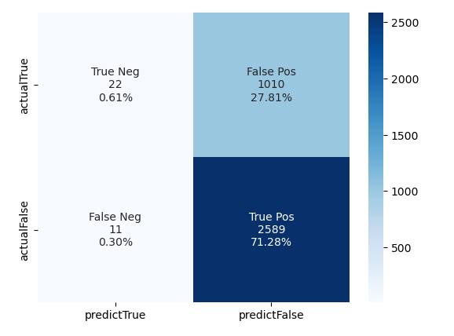
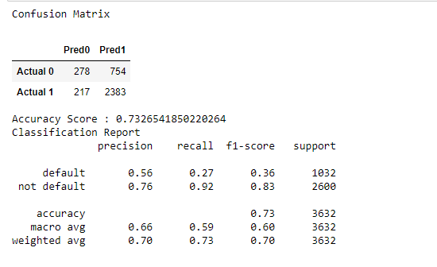
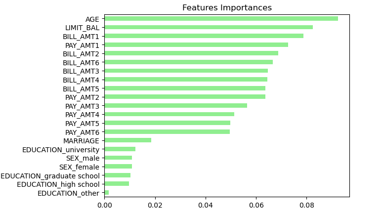
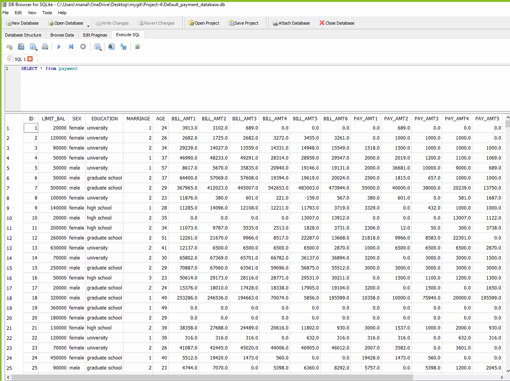

# Loan Defaulter Machine Learning Project
## Overview 
1. **The purpose of the analysis**
	The analysis uses historical data to train and evaluate a model to show how banks collect loans, how they view people's loans and whether they default or do not default on the loans. Our project will discuss the factors that make people default on loans. Also, it will look at the customer’s standard of living, whether they are male or female, income level, education level, and amount of loan they default on.  
2. **About the Data**
	The data is split up into training and testing data. The data here is a large one, it has about 25 columns and about 30,000 rows. It has several columns that the size of the loan, sex, the income level of the borrower, the number of opened accounts, marital status, education level, and the total debt that the borrower has. Also, it has a label showing whether the loan defaults or not. 
3. **Machine Learing Process**
	The Machine Learning Process has features: the size of the loan, sex, the income level of the borrower, the number of opened accounts, marital status, education level, and the total debt that the borrower has.  Also, it has a label that shows the status of the loan and whether people default or do not default on it. Using that data, we can do a first model and an oversampling data. We can calculate the precision, accuracy, and recall level from these two models. 
	* Prepared Data:
	Import data from csv, change the data type, and normalize the data, resampling the data if required(this step is the most important part).
	* Separate the data into features and labels, use train_test_split to separate them into training and testing data set. 
	* Initialize the model.
	* Fitting the model using the training data(X_train, y_train).
	* Use this model to make predictions(use X_test to predict y_predictions).
	* Evaluate the predictions(compare y_predictions and y_test).

4. **Machine Learning Packages**     
```python 
import pandas as pd
import matplotlib.pyplot as plt
import matplotlib.colors as mcolors
import random
from pathlib import Path
from sklearn.metrics import balanced_accuracy_score, confusion_matrix, classification_report, accuracy_score
from sklearn.model_selection import train_test_split
from sklearn.preprocessing import StandardScaler
from sklearn.decomposition import PCA
from sklearn.linear_model import LogisticRegression
from sklearn.ensemble import RandomForestClassifier
from sklearn.model_selection import GridSearchCV
import numpy as np
import seaborn as sns
``` 
## Machine Learning Results
**Logistic Regression Model**      
1. For accuracy    
Accuracy=(TruePositive+TrueNegative)/(TruePositive+TrueNegative+FalsePositive+FalseNegative)=(2589+22)/(2589+22+1010+11)=71.88%
2. For Percision
Percision=TruePositive/(TruePositive+FalsePositive)=2589/(2589+1010)=71.93%
3. Recall
recall=TruePositive/(TruePositive+FalseNegative)=2589/(2589+11)=99.57%    

**Random Forest Model**       
1. For accuracy    
Accuracy=(TruePositive+TrueNegative)/(TruePositive+TrueNegative+FalsePositive+FalseNegative)=(278+2383)/(217+2383+278+754)=73.26%
2. For Percision
Percision=TruePositive/(TruePositive+FalsePositive)=2383/(2383+754)=75.96%
3. Recall
recall=TruePositive/(TruePositive+FalseNegative)=2383/(2383+217)=91.65%   


## Steps for using Random Forest and making Predictions: 
## Loading and Preprocessing Encoded Data
Using the clean data, we tested using X_train2, X_test2, y_train2, y_test2 = train_test_split(X, y, random_state=1).

## Fitting the Random Forest Model
We created a model using the RandomForestClassifier and we fitted the data using X_train2, y_train2 then we made predictions using the X_test2

## Model Evaluation
We evaluated the confusion_matrix for y_test2 and predictions using the confusion matrix


## Feature Importance:
We recognized the important features in the rain forest model that are found in the X.columns and sorted them according to their importance:
.

## Optimizing a Random Forest Classifier Using Grid Search and Random Search:
That is used to find the best performance for a given dataset in terms of achieving a higher accuracy level. That can be done by setting paramters for teh grid space   
in terms of maximum depth, estimators, max features, and minimum samples. 
1. GridSearchCV    
Accuracy=(TruePositive+TrueNegative)/(TruePositive+TrueNegative+FalsePositive+FalseNegative)=(2589+22)/(2589+22+1010+11)=71.88%
2. For Percision
Percision=TruePositive/(TruePositive+FalsePositive)=2589/(2589+1010)=71.93%
3. Recall
recall=TruePositive/(TruePositive+FalseNegative)=2589/(2589+11)=99.57%    

## ETL with SQLITE


## Conclusion
We used logistic regression and Random Forest machine learning skill on this dataset with the default hyperparameter (500 decision trees), the accuracy is 71.88%.     
Also, we used Grid Search CV and Random Search CV to find the best hyperparamter, especially for n_estimator and max_depth and each search takes around 90 minutes because    the dataset is huge. The dataset has 630,000 enteries. The best parameter we found was (n_estimator = 162, max_depth= 15), the accuracy level reached 74.43%.      
In addition to that, we tried SVC, but the accuracy score was not high. I recommend using the random forest model because that model has higher accuracy, it is the best classification model for machine learning. 

